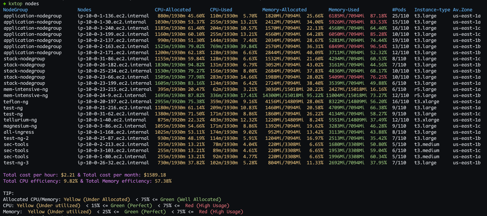
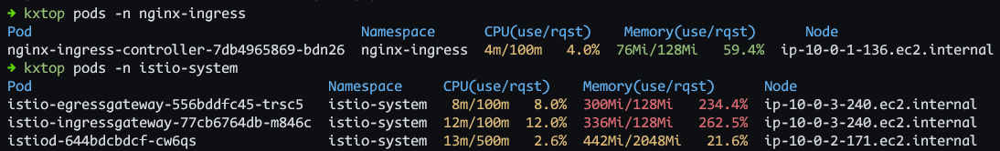

## kxtop - A kubectl top alternative with better features (WIP) custom for AWS EKS
## Usage
Please note that the `kxtop` program is currently under development and only two commands are available: `kxtop nodes` and `kxtop pods`. 

To use `kxtop nodes`, run the following command:
```
kxtop nodes
```


This command will display the resource usage of all nodes in your cluster.

To use `kxtop pods`, run the following command:
```
kxtop pods
(or)
kxtop pods -n <namespace>
```


This command will display the resource usage of respective pods in your cluster.

Please stay tuned for updates as more features and commands will be added in future releases. like `kxtop pvc` (to get pvc usage), `kxtop analytics` (to get whole cluster overview at once).

## Installation

To build the Go program and set it up to be available in the PATH, follow these steps:

1. Make sure you have Go installed on your system. You can download and install Go from the official Go website.

2. Open a terminal or command prompt and navigate inside this project directory in your system after you clone this project.

3. Run the following command to build the Go program:

    ```
    go build .
    ```

    This will compile your Go program and generate an executable file in the same directory.

4. Next, you need to set up the program to be available in the PATH. The PATH is an environment variable that specifies the directories where executable files are located. A short trick for this could be to copy the generated kxtop to /bin/bash (to skip step 4 and 5). Else follow the steps to add the current directory as path:

    - On Linux and macOS, you can add the current directory to the PATH by running the following command:

      ```
      export PATH=$PATH:.
      ```

    - On Windows, you can add the current directory to the PATH by running the following command:

      ```
      set PATH=%PATH%;.
      ```

    This will temporarily add the current directory to the PATH for the current session.

5. To make the program available in the PATH permanently, you need to add the directory containing the executable file to the PATH environment variable.

    - On Linux and macOS, you can edit the `~/.bashrc` or `~/.bash_profile` file and add the following line:

      ```
      export PATH=$PATH:/path/to/directory
      ```

      Replace `/path/to/directory` with the actual path to the directory containing the executable file.

    - On Windows, you can edit the system environment variables and add the directory to the PATH variable.

6. After adding the directory to the PATH, you can run the program from any directory by simply typing its name in the terminal or command prompt.

That's it!

## Contributing
This project is open source, and we welcome contributions from the community. If you have any ideas for new features, improvements, or bug fixes, feel free to submit a pull request or open an issue on our GitHub repository. We appreciate your feedback and contributions to make this project even better!

Happy coding!